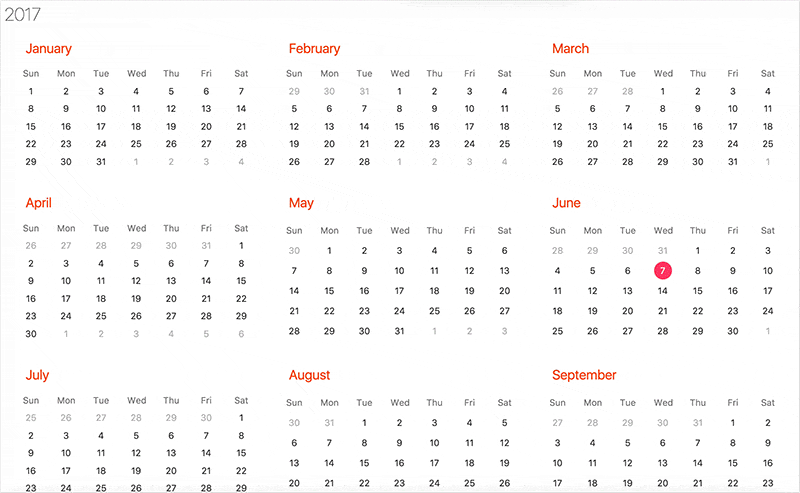

A cross-platform React calendar component 



# Features
- Flexbox layout
- Inline styles using [styled-components](https://www.styled-components.com/) 💅
- Theming support
- Localisation support
- [Storybook](https://storybook.js.org/) browsing
- [Monorepo](https://lernajs.io/) project structure
- React Native component (coming soon)

# Getting Started 
This project is organised into multi-package repositories, a.k.a monorepo.

Lerna is the tool used to create and manage this monorepo.

1. First, clone the repo, then install all the package dependencies and link any cross-dependencies using the `lerna bootsrap` command:
```
git clone https://github.com/johnwakley/react-calendar
cd react-calendar
yarn install
yarn bootstrap
```

2. Preview the calendar component using [Storybook](https://storybook.js.org/)
```
cd packages/react-calendar
yarn storybook
```

# Tests
Run lint, flow, unit and snapshot tests across all packages (execute from root package level)
```
yarn test
```

# Theming
Theming support is provided by styled-components [ThemeProvider wrapper](https://www.styled-components.com/docs/advanced#theming)

Use the default theme structure defined in `/packages/react-calendar/src/themes/ical.js` as the basis for custom styles.

# i18n
Supported locales are listed here: https://github.com/moment/moment/tree/develop/locale

To display the calendar for a specific locale, pass the locale value to the `locale` prop of either the `CalendarYear` or `CalendarMonth` component.
